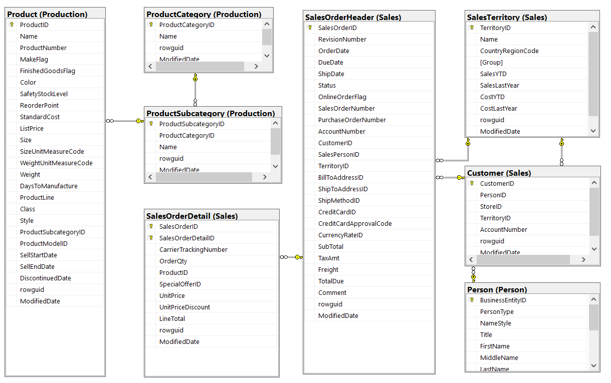
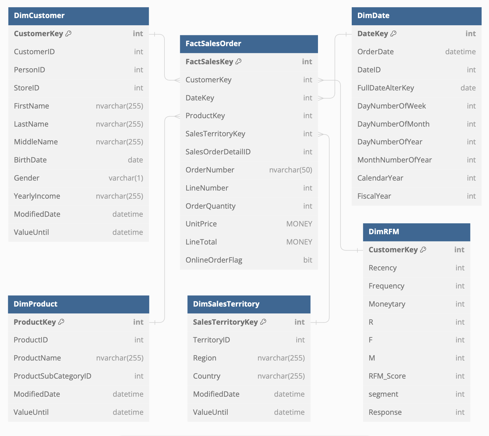
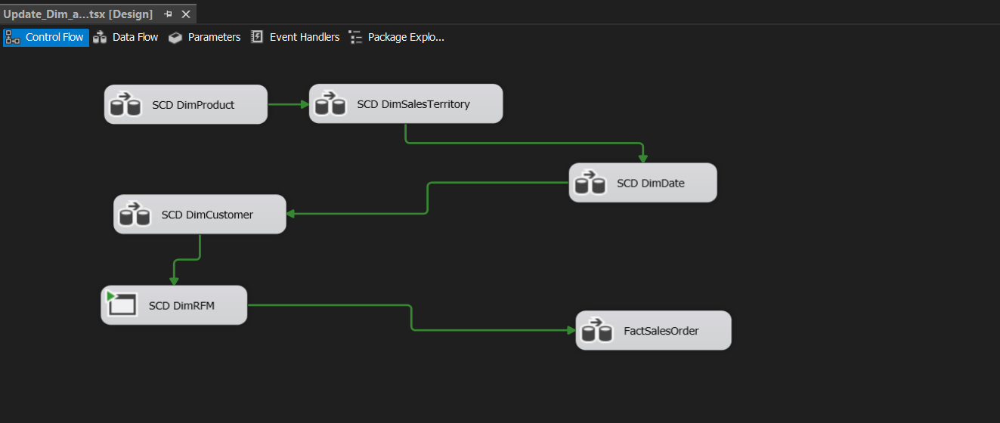
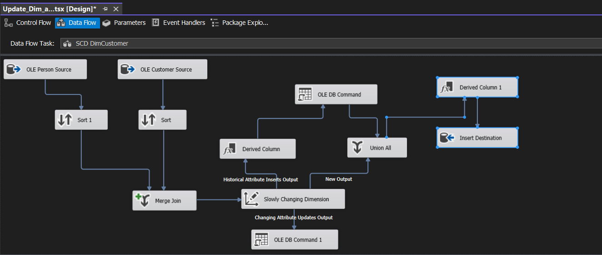
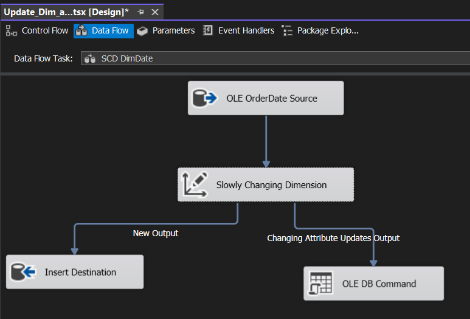
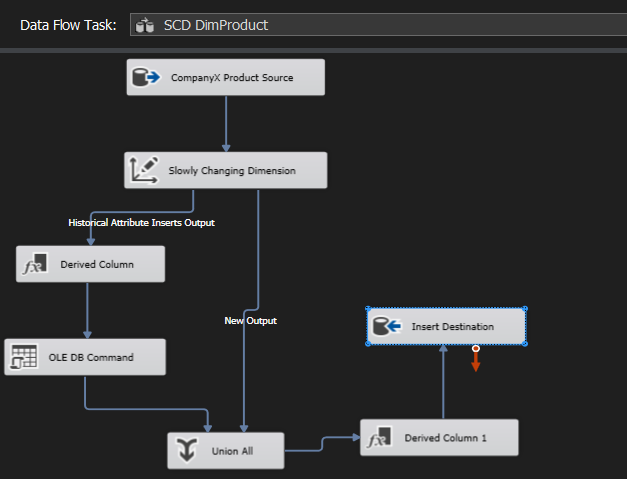
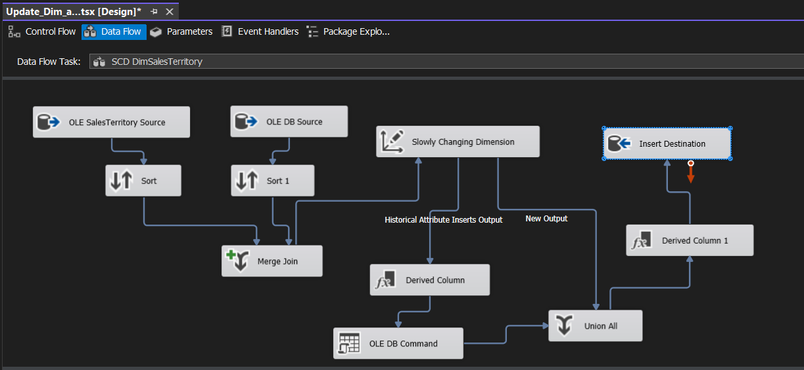
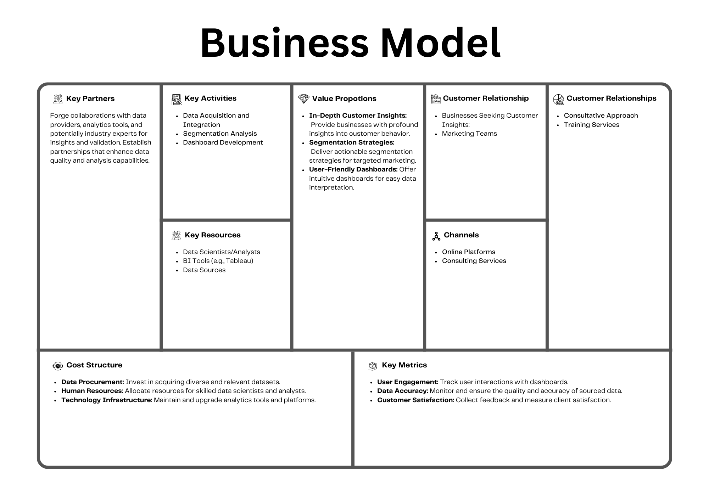

# Analysis-Customer-Segmentation-of-CompanyX-using-RFM-technique

# 1. Introduction

In the vast realm of Business Intelligence, our project centers around the critical theme of "Customer and Segmentation." This deliberate emphasis is strategically chosen to uncover the intricacies of customer behavior and preferences through advanced segmentation analysis. Our analytical foundation rests on the extensive dataset provided by Company X, a valuable resource we intend to exploit to its full potential.

## Topic Overview

Our primary objective is to gain a profound understanding of customer interactions, preferences, and habits. This involves a rigorous analysis utilizing sophisticated segmentation techniques to breathe life into the raw data at our disposal. By discerning patterns among customer groups, we aim not only to decode their present behavior but also to anticipate and shape their future interactions with the company.

## Data Exploration

The preliminary phase involves a meticulous exploration of the Company X dataset. We conduct a comprehensive examination of data fields, delving into the minutiae of tables, attributes, and data points. This exhaustive process aims to unearth the nuances of customer interactions and segmentation-related information, laying the groundwork for subsequent analytical endeavors.

## Identification of Key Tables and Relationships

A crucial aspect is the identification of key tables within the dataset. These tables are repositories of essential information that fuel our Business Intelligence objectives. Our exploration extends beyond individual tables to encompass the intricate relationships between them, poised to derive meaningful insights into customer behavior and segmentation dynamics.

## Potential Data Sources for Customer Information and Segmentation

Recognizing the pivotal role of customer-centric data, our focus extends to identifying potential data sources holding a treasure trove of valuable information for customer analysis and segmentation. Pinpointing these sources ensures that our BI project is fueled by a rich and diverse array of data, enhancing the depth and breadth of our analytical insights.

## Analysis of Data Quality and Completeness

The integrity of our analyses hinges on the reliability and completeness of the dataset. Therefore, we conduct a meticulous analysis of data quality, scrutinizing factors such as accuracy, consistency, and completeness. This rigorous assessment ensures that the foundation of our subsequent Business Intelligence endeavors is robust and trustworthy.

*In essence, this preliminary phase has been an all-encompassing exploration, delving into the intricacies of the Company X dataset. Beyond a mere understanding of data fields, we identify key tables, unravel relationships, and pinpoint potential data sources, indispensable for our upcoming focus on customer analysis and segmentation. Our commitment to evaluating data quality underscores our dedication to delivering insights that are not only insightful but also reliable and actionable. This phase sets the stage for a nuanced and comprehensive exploration of customer behavior and segmentation dynamics in the subsequent stages of our BI project.*

# 2. Problem Statement
The problem at the core of our Business Intelligence (BI) project revolves around understanding and addressing the diverse dynamics within our customer base. This multifaceted challenge encompasses various facets, including the management of good and bad customers, the differentiation between new and longstanding customers, and the consideration of customers with diverse demographic characteristics. Our aim is to effectively navigate this complexity to enhance customer satisfaction, boost sales, and optimize overarching marketing strategies.

In addressing the intricacies of customer diversity, we encounter two pivotal questions. First, how can we comprehensively understand and manage the diverse spectrum of customers within our database? This involves distinguishing between good and bad customers, navigating the nuances of interactions with new and old customers, and considering the varied demographic characteristics that contribute to this diversity. The second question centers on the selection of the most effective variables for customer segmentation. This encompasses a strategic evaluation of demographic, behavioral, and attitudinal data to refine our understanding of customer segments.

Drawing insights from reputable sources such as [Hanover Research](https://www.hanoverresearch.com/insights-blog/what-is-customer-segmentation-examples-and-methods/?org=corporate) and [Chief Marketer](https://www.chiefmarketer.com/customer-segmentation-problems-solutions/), we aim to leverage these perspectives to inform our approach in addressing the complexities of customer segmentation.

The overarching objectives of our BI project are clear: we seek to analyze Company X's data to derive six distinct customer segments, namely Best Customers, Loyal Customers, Big Spender Customers, Almost Lost, Lost Customers, and Lost Cheap Customers. By employing analytical metrics, we intend to provide actionable insights and recommendations tailored to each customer segment. Through this approach, our goal is not only to gain a nuanced understanding of customer behavior but also to offer strategic suggestions that will enable Company X to enhance its treatment of each customer type, thereby fostering improved business outcomes.

# 3. Data warehouse design 

## Data warehouse schema 
The diagram provides a comprehensive representation of the underlying database schema, featuring interconnected tables from various schemas, such as Production, Sales, and Person. Noteworthy tables include Product, ProductCategory, ProductSubcategory, SalesOrderDetail, SalesOrderHeader, SalesTerritory, Customer, and Person. These tables are linked through relationships, primarily established by foreign key constraints, facilitating seamless data retrieval for Business Intelligence (BI) purposes.

Each table serves a distinct role in capturing essential aspects of Company X's operations:

**Product:** Details pertaining to the products offered by Company X, encompassing information like ProductID, Name, and ModifiedDate.

**ProductCategory:** Information categorizing the products into distinct categories, featuring attributes such as ProductCategoryID and ModifiedDate.

**ProductSubcategory:** Further classification of products into subcategories, with attributes like ProductSubcategoryID and ModifiedDate.
SalesOrderDetail: Comprehensive data regarding the specifics of each sales order, including key identifiers like SalesOrderID and ModifiedDate.

**SalesOrderHeader:** Information at the header level for every sales order, with columns like SalesOrderID and ModifiedDate.

**SalesTerritory:** Insights into the sales territories operated by Company X, showcasing attributes like TerritoryID and ModifiedDate.

**Customer:** Details concerning the customers associated with Company X, encompassing key identifiers like CustomerID and ModifiedDate.

**Person:** Information about individuals linked to Company X, featuring a range of attributes such as BusinessEntityID, PersonType, NameStyle, Title, FirstName, MiddleName, and LastName. This rich dataset contributes to a holistic understanding of personnel associated with the company.

## Data star schema
In crafting the architecture for our Business Intelligence framework, we recognized the pivotal role of a well-structured data model. Our choice, the star schema, emerged as the ideal framework to seamlessly analyze and interpret the intricacies of customer behavior, demographics, and transactions. At the core of this design philosophy are six key dimensions, each meticulously curated to provide distinct perspectives. The DimCustomer dimension serves as a comprehensive repository of customer information, while DimProduct sheds light on the intricate details of our product offerings. DimSalesTerritory explores geographical nuances, FactSalesOrder centralizes transactional insights, DimDate delves into temporal aspects, and DimRFM dynamically captures the essence of Customer Relationship Management. This star schema promises not only efficiency in query performance but also clarity in data navigation, laying a foundation for nuanced decision-making.

**DimCustomer:**
This dimension serves as a rich repository of customer information, featuring keys such as CustomerKey and CustomerID, intertwined with personal details like names and birthdates. Utilizing various data types such as integer for keys, nvarchar for names, and date for birthdates, it provides a comprehensive view of each customer's profile.

**DimProduct:**
In this dimension, the spotlight is on products, encapsulating attributes like ProductKey, ProductID, and ProductName. The data types used are intuitive—integers for keys/IDs and nvarchar for product names, offering a structured understanding of each product in our scope.

**DimSalesTerritory:**
This dimension delves into the geographical aspect, incorporating SalesTerritoryKey as the primary key and additional attributes like TerritoryID, Region, and Country. Integers are employed for keys/IDs, while nvarchar serves to capture textual information regarding regions and countries.

**FactSalesOrder:**
At the heart of our schema lies the FactSalesOrder, a pivotal dimension linking to others via foreign keys. It encapsulates critical sales order details, including OrderNumber and LineTotal, expressed through diverse data types such as integers for keys/quantities and nvarchar for order numbers. The MONEY data type steps in to accurately represent monetary values.

**DimDate:**
Date-related information finds its home in DimDate, featuring DateKey as the primary identifier and offering detailed insights into OrderDate and CalendarYear. Primarily utilizing int data types, complemented by datetime, it facilitates a comprehensive understanding of temporal aspects within our dataset.

**DimRFM:**
This dynamic dimension plays a crucial role in Customer Relationship Management, linking back to customer details through CustomerKey. It introduces parameters from the Recency, Frequency, and Monetary (RFM) analysis, represented in integer format, offering a nuanced understanding of customer engagement dynamics.

In concluding the establishment of our star schema, these six dimensions collectively form a structured and efficient framework. They encapsulate the essence of our diverse dataset, promising an insightful journey into customer-centric analysis. As we embark on this data-driven expedition, the star schema stands as a beacon, offering simplicity, scalability, and agility in our pursuit of extracting meaningful business intelligence. This [strategic design](https://dbdiagram.io/d/658cea2689dea62799a648a8) choice sets the stage for a comprehensive exploration of customer dynamics, ensuring that our insights are not only accurate but also easily accessible for informed decision-making.

# 4. ETL pipeline implementation with incremental loading and (near) real-time 
Embarking on the ETL journey for our Business Intelligence initiative, we delve into the intricacies of Extract, Transform, Load (ETL) pipelines. These pipelines act as the lifelines, seamlessly weaving through the vast tapestry of data dimensions. As we unfold the layers of this technological odyssey, our focus extends beyond conventional ETL processes. We not only extract, transform, and load data but strategically implement incremental loading and aspire for (near) real-time updates. This dynamic approach ensures our data warehouse is not a static repository but a living, breathing ecosystem, constantly evolving to meet the demands of our analytical endeavors.

## All Dimension

This image appears to be a data flow diagram in a software interface, likely related to database management or data processing. It shows various entities like “SCD DimProduct”, “SCD DimSalesTerritory”, and others connected through green lines indicating the flow of data or relationships between them. The image background is dark, and the elements are highlighted making them easily visible. At the top, there’s a toolbar with options like “Control Flow”, “Data Flow”, “Parameters”, and others. Below the toolbar, there’s a tab labeled “Update Dim…a.tstx [Design]” indicating that this is a design view of some task or process. There are six rectangular entities with icons and labels such as “SCD DimProduct”, “SCD DimSalesTerritory”, “SCD DimDate”, “SCD DimCustomer”, “SCD DimRFM”, and “FactSalesOrder”. Each entity has an icon on its left; four have similar icons suggesting they might be of similar types or categories, while two have distinct icons. Green lines connect these entities indicating some form of relationship or data flow between them.

# Dim_costumer 

The image shows a graphical user interface of an ETL tool with various components connected to depict the flow of data processing. The title bar at the top indicates that this is the design view of “Update_Dim…a.tskx”. There are two main sources: “OLE Person Source” and “OLE Customer Source”, both having icons representing database tables. These sources are connected to “Sort 1” and another “Sort”, respectively, represented by icons with upward arrows. A “Merge Join” component combines these sorted outputs into one stream. The merged data then flows into a “Derived Column” component before being split into two separate paths: one path leads to “Historical Attribute Inserts Output” and “Changing Attribute Updates Output”, which are part of the “Slowly Changing Dimension” component, while the other path leads directly to another “Derived Column 1” component. Both paths converge at the “Union All” component, represented by an icon with combined arrows. Finally, the unified data stream is directed towards an “Insert Destination” component for storage or further processing
# Dim Date

This image appears to be a screenshot of a data flow diagram in a software development environment, specifically for ETL (Extract, Transform, Load) processes. The image shows the “Update_Dim_a…tsx [Design]*” tab open in a software development tool. There are five main components connected by arrows indicating the flow of data: “OLE OrderDate Source”, “Slowly Changing Dimension”, “New Output”, “Changing Attribute Updates Output”, and “OLE DB Command”. The interface has tabs for “Control Flow”, “Data Flow”, “Parameters”, and “Event Handlers” at the top. The background is dark, and the text and icons are in lighter colors making them stand out. Each component is represented by a rectangular shape with rounded corners containing icons and text labels to identify their functions. Arrows connecting these components indicate the direction of data flow from one process to another
# Dim Product

It outlines the process of extracting data from a source, transforming it, and loading it into a destination. The diagram consists of several boxes and arrows that indicate the direction of data flow between different stages. The first box is labeled “CompanyX Product Source”, indicating the source of the data extraction. Data flows into the “Slowly Changing Dimension” box where transformations occur. There are two outputs from this transformation: one flows into “Historical Attribute Inserts Output” and another to “Derived Column”. The “Derived Column” connects to an “OLE DB Command”, which then connects to “Union All”. Another output labeled as “New Output” emerges from the Slowly Changing Dimension and directly connects to “Insert Destination”. There is also a connection from “Union All” to “Derived Column 1”, which in turn connects to “Insert Destination”.
# Dim SalesTerritory 

The process begins with extracting data from two sources: “OLE SalesTerritory Source” and “OLE DB Source.” These sources are then sorted individually before being merged and joined. The merged data flows into a slowly changing dimension task and an OLE DB command task simultaneously. The slowly changing dimension task outputs historical attribute inserts and new outputs that are transformed through derived columns before being united by a “Union All” operation. Finally, the transformed data is loaded into the “Insert Destination.”

## Conclution 

Our ETL pipeline endeavors go beyond conventional data handling. They embody a strategic vision, incorporating incremental loading and aspirations for (near) real-time updates. These processes not only enhance the efficiency of our data warehouse but position it as a responsive ecosystem, adaptive to the evolving landscape of Business Intelligence. As we traverse these dimensions, the culmination of our efforts promises a resilient, dynamic foundation for data-driven insights.

# 5. Data mining technique  
## RFM Analysis for Customer Segmentation:
In the realm of Business Intelligence, understanding and categorizing customers play a pivotal role in driving strategic decision-making. The RFM model provides a powerful framework for this purpose, examining three crucial dimensions: Recency, Frequency, and Monetary value.

**Recency (R):**

Recency reflects the time elapsed since a customer's last interaction with the business. By assigning recency scores based on a reference date, we can categorize customers into segments such as Best, Loyal, and Regular. The recency scores are derived by analyzing the time intervals between customer interactions.

**Frequency (F):**

Frequency assesses how often a customer engages with the business, often measured by the number of units or products purchased in a transaction. Segments like Big Spenders, Regulars, and Almost Lost are identified by categorizing customers based on their transactional frequency.

**Monetary (M):**

Monetary value delves into the financial contribution of each customer. By evaluating the total sales, dividing them into sections, and assigning corresponding rates, we can identify Big Spenders, Loyal Customers, and Lost Cheap Customers based on their monetary engagement.

**Customer Segmentation:**

The culmination of the RFM analysis results in distinctive customer segments, each characterized by a unique combination of Recency, Frequency, and Monetary values. These segments include Best Customers, Loyal Customers, Big Spender Customers, Almost Lost, Lost Customers, and Lost Cheap Customers.

## RFM Analysis in This Project:

**Reference Date (R):**

- Choose the reference date as 12/1/2013.
- Calculate the Recency (R) for each customer based on the maximum **`other_date`** of each customer.
- Categorize customers based on Recency:
    - If *R* ≤ 60, assign *R* = 3.
    - If 60 ≤ *R* ≤ 120, assign *R* = 2.
    - If *R* > 120, assign *R* = 1.

**Frequency (F):**

- Determine Frequency (F) based on the **`lineNumber`** (number of units/items/products purchased in a transaction).
- Categorize customers based on Frequency:
    - If *F* ≤ 3, assign *F* = 3.
    - If 3 ≤ *F* ≤ 6, assign *F* = 2.
    - If *F* > 6, assign *F* = 1.

**Monetary (M):**

- Assess Monetary (M) based on the total sale (**`line_total`**).
    - Calculate Line_Total as **`Other Quantity * Sales amount`**.
    - Divide Line_Total into three equal sections and assign rates 1, 2, 3 accordingly.

**Customer Segmentation:**

After calculating R, F, and M, combine these values to create segments. Your segments based on RFM values are:

| Segment | RFM | Description |
| --- | --- | --- |
| Best Customer | (333) | Recently bought a lot, buys often, and spends the most. |
| Loyal Customer | (1X1) | Buys very often. |
| Big Spender Customer | (XX3) | Spends the most, regardless of how often they buy. |
| Almost Lost | (233) | Hasn't bought recently, but used to buy frequently and spent the most. |
| Lost Customer | (133) | No recent purchases, but used to buy frequently and spent the most. |
| Lost Cheap Customer | (111) | Last purchase was a long time ago, buys infrequently, and spends little. |
| Others |  | 11 other cases |

### **Business Decision Support:**

Utilize these segments to make informed business decisions.

- Target marketing campaigns specifically for Best and Loyal customers.
- Implement retention strategies for Almost Lost and Lost customers.
- Adjust pricing or promotions for Big Spender customers.
- Monitor and analyze the impact of these strategies on customer behavior over time.

## Forecast customer trends or predict future sales.
(Chưa có)

# 6. BI dashboard
In this pivotal step of our Business Intelligence journey, we have harnessed the power of Tableau to construct a dynamic and insightful BI dashboard. Tableau serves as our canvas, empowering us to seamlessly visualize and distill complex datasets into a coherent and interactive representation. The dashboard we've meticulously crafted encapsulates a multitude of essential metrics, providing a comprehensive snapshot of our business performance from 2011 to 2014.

Within our comprehensive dashboard, a wealth of vital metrics spanning the years 2011-2014 offers a panoramic view of our business landscape. At the forefront is the prominently displayed total sales figure of $14.55M, accompanied by key indicators including orders totaling 30,381 and a customer count of 9,351. These foundational metrics set the stage for a nuanced exploration of our business performance. Delving into sales demographics, a visually impactful pie chart reveals a gender-based breakdown, emphasizing that the majority of sales are attributed to males. Simultaneously, another pie chart underscores the prevalence of internet channels as the primary avenue for sales. A detailed bar graph meticulously lists the top 10 best-selling products, with the illustrious "Road-350-W Red" emerging as the leader in this dynamic landscape.

Taking a temporal perspective, a line graph artfully captures the trend in sales over months, revealing fluctuations without a discernible pattern or evident seasonality within the confines of this static representation. Broadening our scope globally, a world map serves as a visual narrative, spotlighting countries where sales have occurred. Notably, the concentration is pronounced in North America and Europe, reflecting the geographical dynamics of our market outreach.

In a dedicated section on customer segmentation, our dashboard employs a strategic lens to categorize customers into distinct segments. These segments include potential loyal customers, new additions, big spenders, those on the verge of being lost, and, regrettably, customers who have already disengaged. This segmentation not only adds granularity to our understanding of customer behavior but also serves as a compass for targeted strategies, ensuring our business remains attuned to the evolving needs and dynamics of our diverse customer base.

In wrapping up, our user-friendly dashboard for customer and segmentation analysis presents a visually compelling and dynamic tool for informed decision-making. The inclusion of charts, graphs, and maps delivers insights into customer demographics, buying patterns, and segment distributions. For a firsthand experience, explore the interactive Tableau platform via this [**Customer Segmentation Dashboard](https://public.tableau.com/app/profile/nam.nguyen7732/viz/CustomerSegmentationDashboard-RFMAnalysis/Dashboard1?publish=yes).** This dashboard not only simplifies data comprehension but empowers users to customize analyses, showcasing the practicality of our strategic use of BI platforms. It stands as a testament to our commitment to data-driven excellence in customer analysis.

# 7. One use-case to show how your analysis supports business decision making 
(chưa có)

# 8. I****nsights, Challenges, and Recommendations****

**Insights:**

Our exploration into the dataset of Company X yielded valuable insights into customer behavior and segmentation dynamics. Through meticulous analysis, we discerned patterns revealing diverse customer interactions and preferences. The dashboard, crafted with Tableau, showcased crucial metrics such as total sales, orders, and customer counts. Visualizations like pie charts and bar graphs provided a nuanced understanding of sales patterns, and a world map highlighted regions with significant sales concentration. The customer segmentation section categorized customers, offering a holistic view of their engagement levels.

**Challenges:**

While unraveling these insights, we encountered challenges inherent in data analysis. Ensuring data quality and completeness posed initial hurdles, demanding thorough scrutiny. Additionally, aligning diverse data sources for comprehensive customer analysis proved intricate. The dynamic nature of customer behavior presented challenges in identifying universal segmentation variables, requiring careful consideration and iterative refinement.

**Recommendations:**

To address challenges and enhance future analyses, we propose:

1. **Data Quality Assurance:** Implement robust data quality checks and validation protocols to ensure the reliability and completeness of incoming data.
2. **Integration of Data Sources:** Develop streamlined processes for integrating diverse data sources, fostering a more comprehensive view of customer information.
3. **Dynamic Segmentation Strategies:** Explore dynamic segmentation approaches, adjusting variables based on evolving customer behavior, ensuring the continued relevance of segmentation models.
4. **User-Friendly Dashboard Refinement:** Continuously refine the Tableau dashboard, incorporating user feedback for a more intuitive and informative user experience.

This phase serves as a foundation for subsequent BI endeavors, offering not only insights into customer dynamics but also valuable lessons for refining our analytical strategies. The fusion of data-driven insights and adaptive strategies positions us favorably for future challenges in the dynamic landscape of customer analysis and segmentation.

# 9. Business model for analysis

The proposed business model strategically outlines key elements for the success of our Customer Analysis and Segmentation project. In establishing robust operations, key partnerships will be forged with prominent data providers, analytics tools, and industry experts. These collaborations are pivotal to enhancing data quality and analysis capabilities, ensuring the delivery of comprehensive insights.

Our key activities revolve around a meticulous approach to data acquisition and integration. Diverse datasets, specifically tailored to capture various facets of customer behavior, will be procured. The heart of our analytical efforts lies in the implementation of advanced segmentation analysis, leveraging the expertise of skilled data scientists and analysts. Subsequently, our focus shifts to the development of user-friendly dashboards, employing powerful BI tools like Tableau. These dashboards are designed to visually represent complex data, enabling easy interpretation for businesses seeking profound insights.

The key resources instrumental to this endeavor include a talented team of data scientists and analysts, cutting-edge BI tools for effective dashboard creation, and access to varied and reliable datasets. Our value propositions center on providing in-depth customer insights, actionable segmentation strategies for targeted marketing, and the delivery of user-friendly dashboards that facilitate seamless data interpretation.

Our identified customer segments encompass businesses aiming to enhance their understanding of customer behavior and marketing teams seeking targeted strategies for customer engagement. Channels for delivering our insights will primarily involve online platforms and consulting services. We emphasize a consultative approach and offer training services to client teams, ensuring effective utilization of the provided dashboards.

The cost structure is carefully delineated, encompassing investments in data procurement, allocation of resources for skilled data scientists and analysts, and the maintenance and upgrading of analytics tools and platforms. Key metrics for success include tracking user engagement with dashboards, ensuring data accuracy through rigorous monitoring, and measuring overall client satisfaction through feedback mechanisms.

Looking towards the future, our business model emphasizes continuous evolution. This involves integrating emerging technologies, staying abreast of data privacy regulations, and expanding our services to meet evolving market demands. The sustainability of our revenue structure is underscored by subscription models and consulting fees, highlighting our commitment to delivering actionable insights, fostering lasting relationships, and adapting to ensure client success in a dynamic business landscape.

# Reference 
**Business Model:** [Canva Business Model](https://www.canva.com/design/DAF024BkWiI/b4LEMFsjSPxg9Yr_jKT7_A/edit?utm_content=DAF024BkWiI&utm_campaign=designshare&utm_medium=link2&utm_source=sharebutton)

**Presentation:** [Canva Presentation](https://www.canva.com/design/DAF4-4Nu_u4/e1HzwBFVUWvm8Oh0uqK1jQ/view?utm_content=DAF4-4Nu_u4&utm_campaign=share_your_design&utm_medium=link&utm_source=shareyourdesignpanel)

**BI Dashboard:** [Tableau BI Dashboard](https://public.tableau.com/app/profile/nam.nguyen7732/viz/CustomerSegmentationDashboard-RFMAnalysis/Dashboard1?publish=yes)

**Database Diagram:** [dbdiagram.io Database Diagram](https://dbdiagram.io/d/658cea2689dea62799a648a8)
